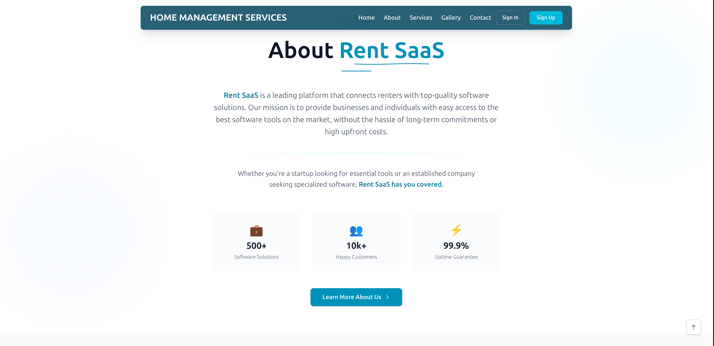
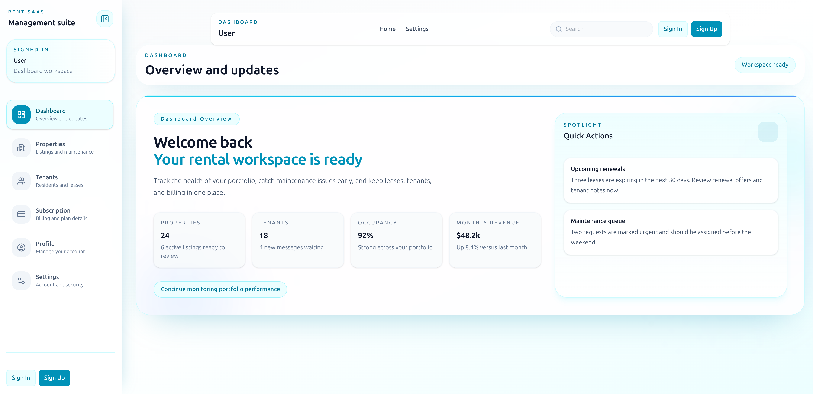

# Rent SaaS

Rent SaaS is a full-stack rental management application with a Vite React frontend and an Express/Prisma backend.

## Clone

```bash
git clone https://github.com/Lyfyn-web/Rent-SaaS.git
cd Rent-SaaS
```

## Install Dependencies

Install dependencies for both parts of the app:

```bash
cd frontend
npm install

cd ../backend
npm install
```

If you are setting the project up for the first time, make sure the backend environment variables are configured before starting the server.

## Run Locally

Start the backend:

```bash
cd backend
npm start
```

In a separate terminal, start the frontend:

```bash
cd frontend
npm run dev
```

## Project Structure

- `frontend/` contains the React app built with Vite.
- `backend/` contains the Express API, Prisma setup, and database schema.

## Screenshots





## Contributing

Contributions are welcome.

1. Fork the repository.
2. Create a new branch for your change.
3. Make your updates and test them locally.
4. Open a pull request with a clear description of the change.

Please keep changes focused, follow the existing code style, and avoid introducing unrelated edits.

## License

This project is licensed under the MIT License. See the [LICENSE](LICENSE) file for details.
